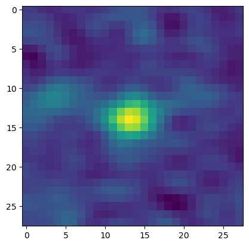

# LoFAR Survey Archive - Python Package

Small package that will generate a source cutout from the LoFAR Survey Archive given a valid position. It can also interface with the LoFAR source catalogue to return catalogue information from a specfic position and search radius.

## Table of contents

## Installation
This package can be installed using pip.
```bash
pip install LCSpy
```
### Dependencies:
* Astropy 
* requests 
* json
* numpy

### Dev-dependencies (optional)
* unittest

## Searching the Source Catalogue.

```python
import LCSpy

Sources = LCSpy.LoFAR_cat_search(ra={'h':15,'m':16,'s':12.35},dec={'h':45,'m':36,'s':03.1},sr=1)
Sources.total_data
```
Output:
[['ILTJ151614.06+453524.4',229.058578709231,0.340728573673463,45.5901286238848,0.230064337704425,0.752771173177558,0.0656867834991941,1.18621806479747,0.156623581872246, ... ]

Alternatively you can ...

```python
print('Name: ',Sources.Name)
print('Ra: ',Source.Ra)
print('Dec: ',Source.Dec)
print('Mosaic_id: ',Source.Mosiac_id)
```
Output: \
Name: ILTJ151614.06+453524.4 \
Ra: 229.058578709231 \
Dec: 45.5901286238848 \
Mosaic_id: P229+45
## Generate Source Image Cutouts.

```python
import LCSpy
import matplotlib.pylab as plt

Image = LCSpy.cutout2d(ra=229.0586,dec=45.5901)
plt.imshow(Image)
plt.show()
```

